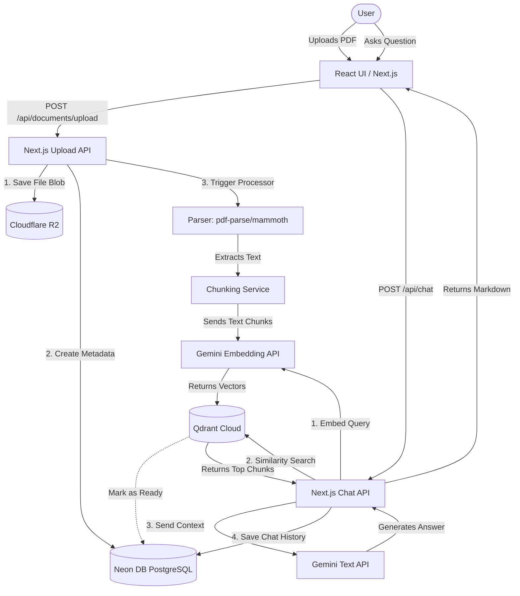

# Technical Stack & Architecture Guide

This document outlines the specific technologies used in the RAG (Retrieval-Augmented Generation) platform, detailing **why** they were chosen, **how** they are technically utilized, and the overarching **process flow**.

---

## 1. Core Framework & UI
### **Next.js 16 (App Router) & React**
- **Why it is used**: Next.js provides a unified environment for both the frontend (React Server Components) and the backend (Serverless API Route Handlers). It optimizes page loads and SEO while allowing us to write our backend logic in the same repository (Monorepo architecture).
- **Technical Usage**: We heavily utilize App Router (`app/api/...`) for our backend endpoints. The frontend uses Client Components (`"use client"`) for interactive elements like the chat interface, and Server Components to fetch initial data securely without exposing API keys to the browser.

### **Tailwind CSS & shadcn/ui**
- **Why it is used**: Tailwind allows for rapid, utility-first styling without context-switching to CSS files. `shadcn/ui` provides beautiful, accessible, and unstyled base components (like dialogs, spinners, and buttons) that we fully own and can customize.
- **Technical Usage**: Used to implement dark mode (`next-themes`), responsive layouts, and rich animations (e.g., flipping flashcards, pulsing AI loading states).

---

## 2. Data Persistence & Storage
### **Neon DB (Serverless PostgreSQL)**
- **Why it is used**: Neon DB is built for the serverless edge. Traditional PostgreSQL databases struggle with connection limits when serverless functions spin up rapidly. Neon handles connection pooling natively and scales compute to zero when inactive, making it highly cost-effective.
- **Technical Usage**: Stores all relational metadata, including Users, Workspaces, Settings, Document upload logs, and Chat session histories. 

### **Prisma ORM**
- **Why it is used**: Prisma provides a strictly typed database client. It prevents SQL injection attacks, automatically generates TypeScript types based on our schema, and manages database migrations effortlessly.
- **Technical Usage**: We define our schema in `prisma/schema.prisma` and use the generated Prisma Client inside our Next.js API routes (e.g., `prisma.chatSession.upsert(...)`) to query Neon DB safely.

### **Cloudflare R2**
- **Why it is used**: Cloudflare R2 is an S3-compatible object storage solution that charges **zero egress bandwidth fees**. This makes downloading and serving large PDFs or files significantly cheaper than Amazon S3.
- **Technical Usage**: When a user uploads a file, it is streamed to R2 via the `@aws-sdk/client-s3` library. The database only stores the R2 `storageKey` string.

---

## 3. AI & Vector Engine
### **Qdrant Cloud (Vector Database)**
- **Why it is used**: Large Language Models (LLMs) cannot read thousands of documents at once due to context window limits. We need to find only the paragraphs relevant to the user's question. Qdrant is an ultra-fast vector search engine written in Rust that excels at semantic similarity search.
- **Technical Usage**: We store text "chunks" as high-dimensional arrays of numbers (embeddings) in Qdrant. When a user asks a question, we embed the question and ask Qdrant to find the nearest mathematical vectors using Cosine Similarity.

### **Google Gemini / OpenAI APIs**
- **Why it is used**: These provide the underlying intelligence for the application. They are used for two distinct purposes: Embedding (turning words into math) and Generation (reading context to answer questions).
- **Technical Usage**: Integrated via their official SDKs (`@google/generative-ai` and `openai`). We route calls dynamically based on the user's configuration in the `ProviderResolver` factory.

---

## 4. Document Processing Tools
### **`pdf-parse`, `mammoth`, `xlsx`**
- **Why it is used**: AI models cannot read binary files like `.pdf` or `.docx` directly. We must extract the raw plaintext first.
- **Technical Usage**: 
  - `pdf-parse` reads text layers from PDFs.
  - `mammoth` securely converts DOCX XML structures into plain text or HTML without relying on Microsoft Word installations.
  - `xlsx` extracts grid-level data from Excel sheets.

---

## 5. The End-to-End System Process

To understand how these tools connect, here is the lifecycle of a user interacting with the platform:

1. **Authentication (Better Auth + Neon DB)**
   The user visits the site. Middleware checks for a JWT session cookie. If absent, they log in. `better-auth` validates credentials against Neon DB and provisions a secure session.

2. **Upload Pipeline (Next.js API + Cloudflare R2)**
   The user uploads a PDF. Next.js receives the `FormData`, saves the raw binary to Cloudflare R2, and creates a `Document` record in Neon DB labeled as `PROCESSING`.

3. **Parsing & Chunking (Parser Libs)**
   The backend downloads the file back into memory. `pdf-parse` extracts all the text. The `ChunkingService` slices this massive string into overlapping 1,000-character blocks so no context is accidentally cut in half.

4. **Embedding & Indexing (Gemini API + Qdrant Cloud)**
   Each text chunk is sent to the Gemini API (`gemini-embedding-001`), returning a vector array (e.g., `[0.024, -0.932, ...]`). These vectors, alongside their original text, are pushed to Qdrant Cloud. The Neon DB document status is updated to `READY`.

5. **Semantic RAG Querying (Qdrant + Next.js + UI)**
   The user asks: "What is our Q3 revenue?".
   - Next.js embeds the question using Gemini API.
   - Next.js queries Qdrant Cloud with the question's vector.
   - Qdrant mathematically finds the top 5 chunks containing revenue data and returns the raw text.
   - Next.js builds a massive prompt: *"Answer the user using only this context: [Chunk 1, Chunk 2]"* and sends it to the Gemini Text Generation model.
   - The AI returns the answer. 
   - `react-markdown` formats the response beautifully on the user's screen.

---

## 6. Architecture Diagram

Below is a visual representation of how data flows through the RAG architecture:

